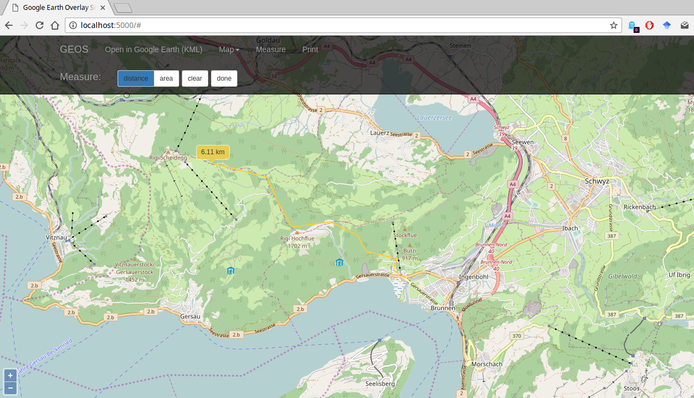

## Installation

Instructions for running GEOS in a docker container can be found [below](https://github.com/tostt/geos/blob/docker/doc/users.md#running-geos-in-a-docker-container).

### Requirements
GEOS is python3 only. If you don't have python, I recommend downloading
[Anaconda Python](https://www.continuum.io/downloads).

### Install GEOS
Usually, it's easiest to install *GEOS* through `pip`:

```
pip install geos
```

Alternatively, you can install *GEOS* from the github sources:
```
git clone git@github.com:grst/geos.git
cd geos
pip install -e geos
```


## Usage
```
usage: geos [-h] [-m MAPSOURCE] [-H HOST] [-P PORT]
            [--display-host DISPLAY_HOST] [--display-port DISPLAY_PORT]
            [--display-scheme DISPLAY_SCHEME]

optional arguments:
  -h, --help            show this help message and exit
  -m MAPSOURCE, --mapsource MAPSOURCE
                        path to the directory containing the mapsource files.
                        [default: integrated mapsources]
  -H HOST, --host HOST  Hostname of the Flask app [default localhost]
  -P PORT, --port PORT  Port for the Flask app [default 5000]
  --display-host DISPLAY_HOST
                        Hostname used for self-referencing links [defaults to
                        Flask hostname]
  --display-port DISPLAY_PORT
                        Port used for self-referencing links [defaults to
                        Flask port]
  --display-scheme DISPLAY_SCHEME
                        URI-scheme used for self-referencing links [default
                        http]
```

To try out *GEOS*, simply open a terminal, type `geos` and hit enter! A web server will start.
Note, that by default, the webserver is only reachable locally. You can adjust this using the `-H` parameter. If you use GEOS with a public url, e.g. `http://geos.example.com`, you can adjust the public hostname, port and scheme using the `--display-*` arguments. 

Open your browser and navigate to the URL. A web page will displaying a map and a menu bar.
You can use the menu bar to choose between maps. Per default, it only contains the
[OSM Mapnik](https://wiki.openstreetmap.org/wiki/Mapnik).
From the menu bar, you can also choose tools to measure, draw and print maps.




### Open in Google Earth
Choose *"Open in Google Earth (KML)"* from the menu bar to download a KML file which you can open in Google Earth.
The KML file will appear in the 'places' pane. Activate the checkbox
of the map you want to display there:


Once the checkbox is activated, the mapoverlay should load.
Note, that some maps do not provide tiles below a certain zoom level.
In that case you have to zoom in for the tiles to load.

## More maps!
*GEOS* uses XML [Mapsource](http://mobac.sourceforge.net/wiki/index.php/Custom_XML_Map_Sources#Simple_custom_map_sources)
files, to tell the server where it can find the tiles. I started a collection of such mapsources in a
[dedicated Github repository](https://github.com/grst/mapsources).

You can specify a directory containing xml mapsources using the `-m` command line parameter.
*GEOS* will load all maps from that directory and put them into the kml file.

So, to start off, you can do the following:
```
git clone git@github.com:grst/mapsources.git
geos -m mapsources
```

Of course, you can create your own maps, too! If you do so, it would be cool if you shared them,
 e.g. by creating a pull request to the [mapsources repo](https://github.com/grst/mapsources).

## Creating Mapsources
Essentially, the mapsources for *GEOS* are based on the [MOBAC Mapsource XML Format](http://mobac.sourceforge.net/wiki/index.php/Custom_XML_Map_Sources#Simple_custom_map_sources).

A minimal Mapsource file for *GEOS* looks like this:
```xml
<customMapSource>
    <name>Example Map</name>  <!-- Name of the map as displayed in Google Earth -->
    <minZoom>5</minZoom>      <!-- minimal zoom level supported by the web map -->
    <maxZoom>15</maxZoom>     <!-- maximal zoom level supported by the web map -->
    <!-- url: tells GEOS where to find the tiles. Tile URLs contain three
    Parameters: zoom, x and y -->
    <url>http://example.com/map?zoom={$z}&amp;x={$x}&amp;y={$y}</url>
</customMapSource>
```

Additonally, *GEOS* currently supports the following optional parameters:
```xml
    <id>example_id</id>                    <!-- unique map identifier. If not specified,
                                                the filename will be used as id -->
    <folder>europe/switzerland</folder>    <!-- use this tag to organize your maps in Folders
                                                which will show up in Google Earth. If not specified,
                                                GEOS will try to obtain the folder from the directory
                                                tree, in which the mapsources are saved in. -->
    <region>                               <!-- Set map boundaries. No tiles will load outside -->
        <north>54.5</north>                <!-- Use geographic coordinates here.  -->
        <south>40</south>
        <east>15</east>
        <west>5</west>
   </region>
```

### Multi Layer Mapsources
GEOS supports Mapsources which consist of multiple layers. Such a file looks as follows:

```xml
<?xml version="1.0" encoding="UTF-8"?>
<customMultiLayerMapSource>
   <name>Custom OSM Mapnik with Hills (Ger)</name>
   <layers>
      <customMapSource>
         <name>Custom OSM Mapnik</name>
         <minZoom>0</minZoom>
         <maxZoom>18</maxZoom>
         <url>http://tile.openstreetmap.org/{$z}/{$x}/{$y}.png</url>
      </customMapSource>
      <customMapSource>
         <name>cycling trails</name>
         <minZoom>0</minZoom>
         <maxZoom>18</maxZoom>
         <url>https://tile.waymarkedtrails.org/cycling/{$z}/{$x}/{$y}.png</url>
       </customMapSource>
   </layers>
</customMultiLayerMapSource>
```

### Running GEOS in a docker container
If you are planning to run GEOS in a docker container, there is no requirement apart from having docker installed on your host. No install of python is necessary.

Running GEOS involves building a GEOS image, a one-time operation, and then running a container.
1. **Building the GEOS docker image**

Building the container will likely take a few minutes and your machine may look stalled during the lengthy install of lxml. To build the image, move to the main directory (where the Dockerfile is) and run :
```
docker build -t geos .
```

2. **Running the GEOS container**

Run (on a single line) :
```
docker run
--rm 
-p <server_port>:5000
-v <server_mapsources_directory>:/opt/conda/lib/python3.7/site-packages/geos/mapsources
geos
geos --host 0.0.0.0 --display-host <server_ip>
```

You will have to substitute the following variables with a value that is relevant to your setup :

| Variable                          |Meaning                                         |Example|
|-----------------------------------|------------------------------------------------|----|
|```<server_port>```                |Port used to reach the server                   |```5000```|
|```<server_mapsources_directory>```|Path to the `mapsources` directory on the server|```/home/user/Documents/geos/mapsources```|
|```<server_ip>```                  |IP adress of the server                         |```192.168.0.1``` / See note below|

Note:
* On Linux systems, ```<server_ip>``` can be found by running ```ip route get 1 | awk '{print $NF;exit}'```
